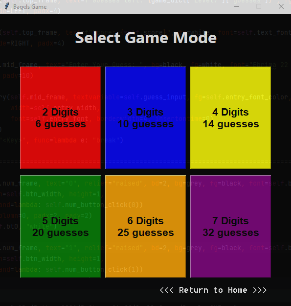
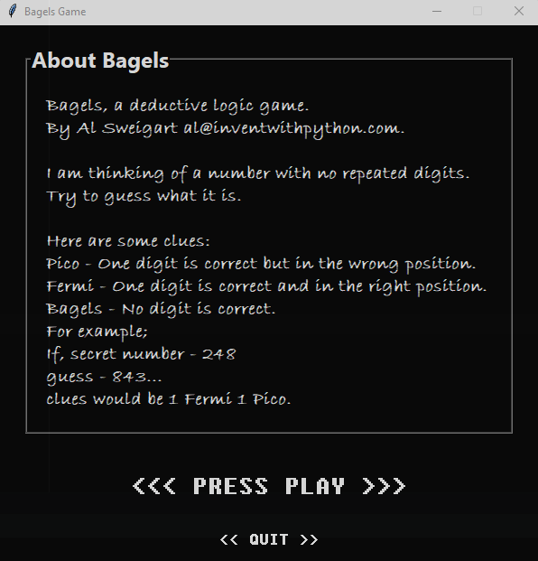

# Bagels Game

> Bagels is a deductive logic game by Al Sweigart al@inventwithpython.com.

---

### Table of Contents

- [Description](#description)
- [How To Use](#how-to-use)
- [About Bagels](#about-bagels)
- [References](#references)
- [License](#license)
- [Author Info](#author-info)

---

## Description
Bagels is a deductive logic game by Al Sweigart. It is a simple number guessing game. 

### Features

- Graphic User Interface with Tkinter library
- An automatic score calculator
- A counter for the number of guesses left
- Six difficulty levels
- A color scheme for each level

#### Technologies

- Python
- Tkinter Library
- PyCharm

[Back To The Top](#bagels-game)

---

## How To Use

Main Project Folder available in the `main` branch.
Run "gui.py" to start the game.

#### Installations

No installations.

---

## About Bagels

---

## References

- The Big Book of Small Python Projects 81 Easy Practice Programs by Al Sweigart 
- LinkedIn - [Mary-Ann Egbudom](https://www.linkedin.com/in/mary-ann-egbudom-9017b3109)
- Twitter - [@Rianne_egb](https://twitter.com/Rianne_egb)

[Back To The Top](#bagels-game)

---

## License

MIT License

Copyright (c) [2022] [Mary-Ann Egbudom]

Permission is hereby granted, free of charge, to any person obtaining a copy
of this software and associated documentation files (the "Software"), to deal
in the Software without restriction, including without limitation the rights
to use, copy, modify, merge, publish, distribute, sublicense, and/or sell
copies of the Software, and to permit persons to whom the Software is
furnished to do so, subject to the following conditions:

The above copyright notice and this permission notice shall be included in all
copies or substantial portions of the Software.

THE SOFTWARE IS PROVIDED "AS IS", WITHOUT WARRANTY OF ANY KIND, EXPRESS OR
IMPLIED, INCLUDING BUT NOT LIMITED TO THE WARRANTIES OF MERCHANTABILITY,
FITNESS FOR A PARTICULAR PURPOSE AND NONINFRINGEMENT. IN NO EVENT SHALL THE
AUTHORS OR COPYRIGHT HOLDERS BE LIABLE FOR ANY CLAIM, DAMAGES OR OTHER
LIABILITY, WHETHER IN AN ACTION OF CONTRACT, TORT OR OTHERWISE, ARISING FROM,
OUT OF OR IN CONNECTION WITH THE SOFTWARE OR THE USE OR OTHER DEALINGS IN THE
SOFTWARE.

[Back To The Top](#bagels-game)

---

## Author Info

- LinkedIn - [Mary-Ann Egbudom](https://www.linkedin.com/in/mary-ann-egbudom-9017b3109)
- Twitter - [@Rianne_egb](https://twitter.com/Rianne_egb)

[Back To The Top](#bagels-game)
